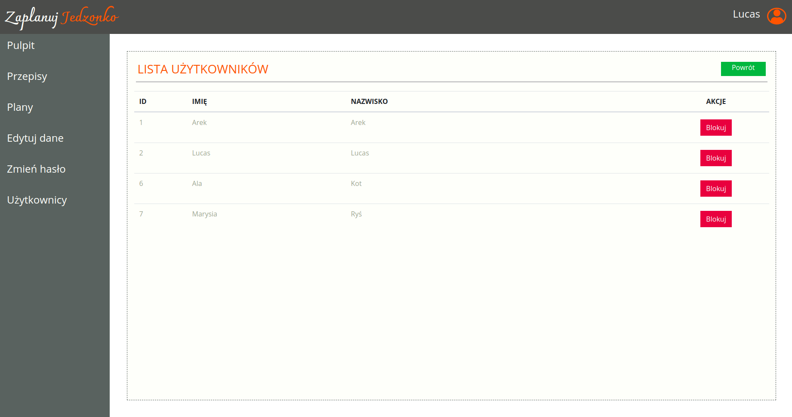

# Recipe App (Spring)
RecipeApp application for adding and managing nutritional plans and recipes.
Project was made to learn Spring Boot and Spring Security. 

## Table of contents
* [General info](#general-info)
* [Screenshots](#screenshots)
* [Technologies](#technologies)
* [Setup](#setup)
* [Features](#features)
* [Status](#status)

## General info
Pair Programming with Krzysztof Dyrkacz: https://github.com/KrzysiekDyrkacz through WebAppTeam2020 Repository.  
Project was made in free time to learn Spring Boot and Spring Security before starting SurveyApp Project. 

## Screenshots

## Technologies
* Java
* Spring Boot
* Spring Security
* Spring JPA (Hibernate)
* JavaServer Pages (JSP)

## Setup
Prerequisites
* Java 8 or above
* Maven
* IDE IntelliJ

* Clone this repo in local machine
* Start app in IDE, browser should open automaticly on landing page

## Features
* registration
* logging in
* adding, modyfing and deleting recipes
* displaying a list of recipes
* creating, viewing and modyfing a nutrition schedule
* browsing and blocking users by administrator
* meal list managment for logged user

## Status
Project need a few more controllers with views to display all data. 
Main functionalities already added. 
